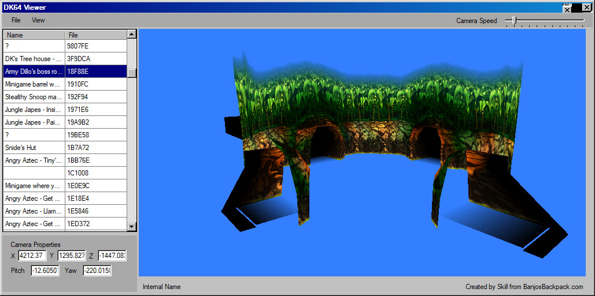

 # DK64Viewer
 
DK64 Viewer.

Source for future game modding/documentation

A model/map viewer for DK64. Currently exports broken levels to base obj, and models don't load textures
TODO: Fix these issues in future???

Original program by [@cooliscool](https://soundcloud.com/jeremy-johnson-24) and [@Skill](https://www.romhacking.net/community/1091/).

Special thanks to [@z64me](https://github.com/z64me) and [@SpiceyWolf](https://github.com/SpiceyWolf) for helping teach me how to decompile this.

|                           |
| ------------------------------------------------------------------- |
| *Pictured: Army Dillo Boss room 1 in DK64Viewer.*  |
